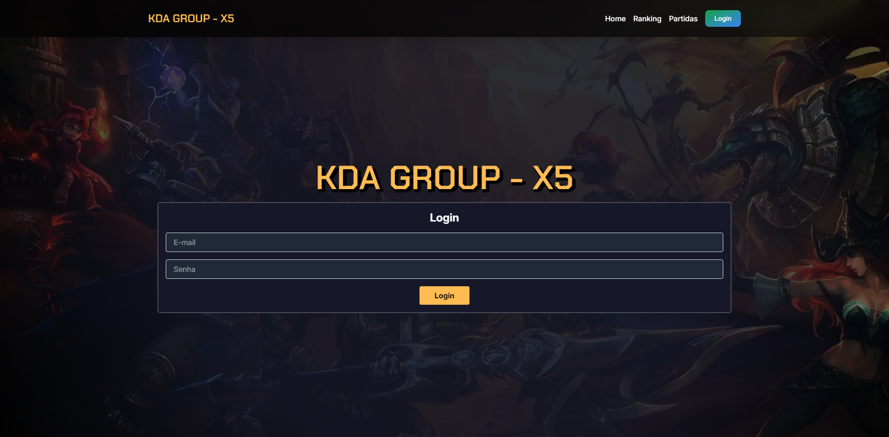
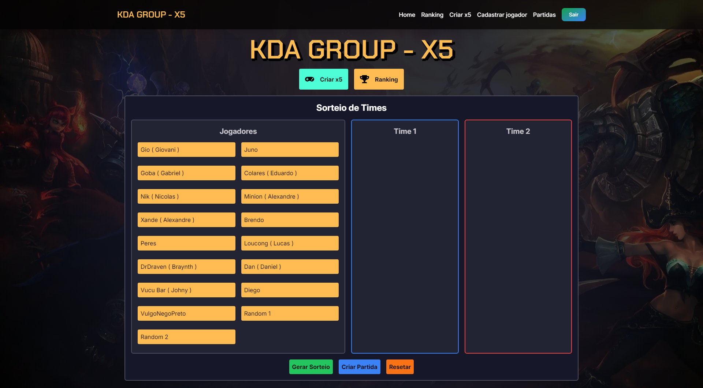
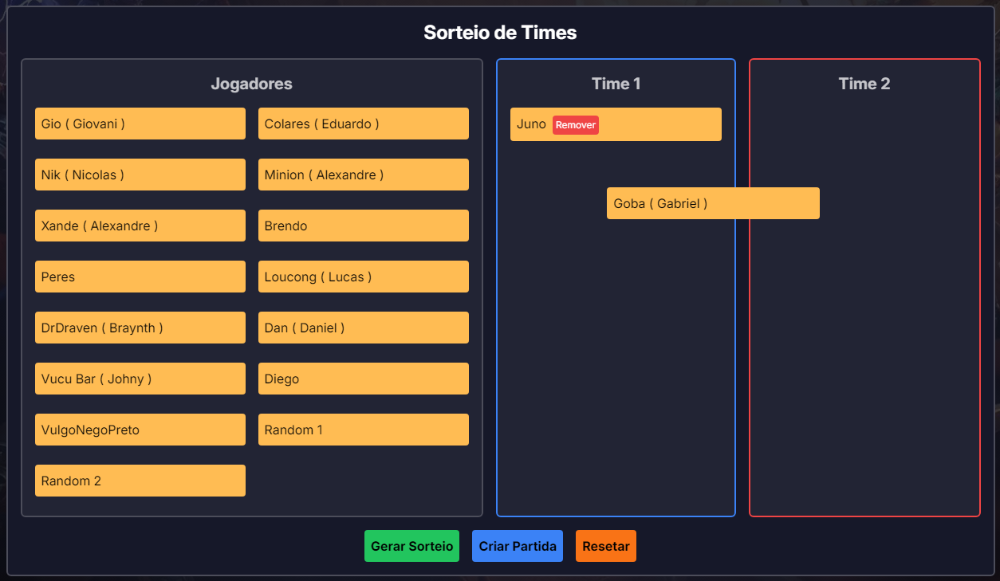
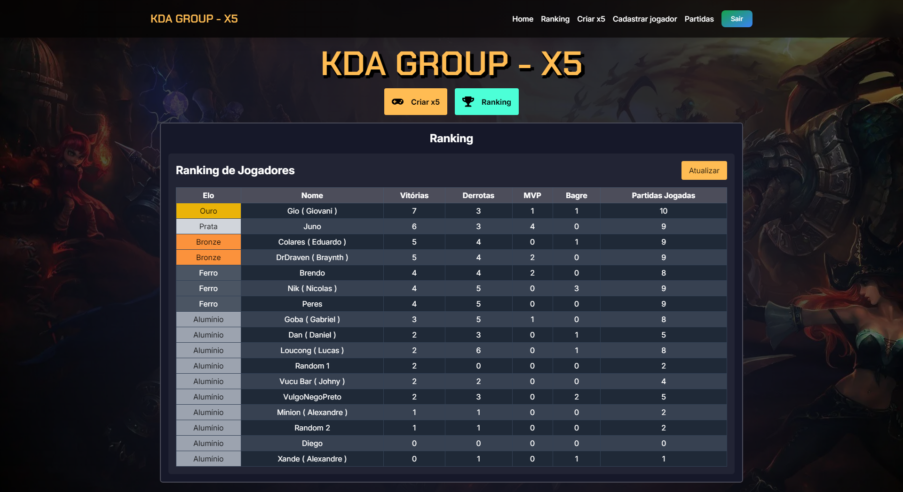
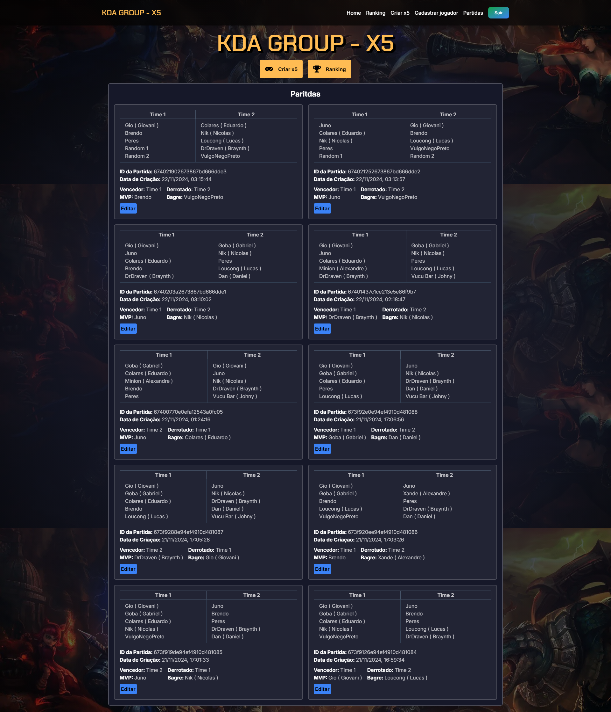

# Gerenciamento de Partidas - Sorteio e Ranking de Jogadores 🎮⚽

## Sobre o Projeto

Esse é um projeto que desenvolvi para facilitar a organização de partidas entre amigos. O sistema sorteia **10 jogadores aleatórios** divididos em **dois times de 5**, permitindo saber quem fará parte de cada equipe. Além disso, implementei um recurso de **arrastar e soltar (drag and drop)** para ajustes manuais, caso seja necessário balancear os times ou cadastrar uma nova partida.

Com esse sistema, também é possível realizar diversos controles, como:
- **Ranking de jogadores** com mais vitórias e derrotas.
- Sistema de **MVP** (Melhor Jogador da Partida) e **Bagre** (Pior Jogador da Partida).
- Monitoramento do desempenho individual e coletivo.

Este projeto nasceu da necessidade de um grupo de amigos que se reúne quase todos os dias para jogar. Agora, podemos acompanhar o desempenho de cada um com mais facilidade. Além disso, esse projeto foi uma oportunidade para testar e melhorar minhas habilidades como desenvolvedor **fullstack**, sendo um desafio avançado e complexo.

---

## Tecnologias Utilizadas 🛠️

- **Frontend**: [Next.js](https://nextjs.org/), [TypeScript](https://www.typescriptlang.org/), [Tailwind CSS](https://tailwindcss.com/)
- **Backend**: [Prisma](https://www.prisma.io/), [MongoDB](https://www.mongodb.com/), [NextAuth](https://next-auth.js.org/)
- **Outros Recursos**:
  - Login por JWT com **NextAuth** para treinar autenticação.
  - Implementação de **drag and drop** para interatividade.
  - Utilização de `middleware.ts` para segurança de rotas privadas.
  - Otimização de desempenho com imagens em formato **WebP**.

---

## Status do Projeto 🚧

O sistema ainda está **incompleto**, mas em fase avançada de desenvolvimento. 

### Funcionalidades Implementadas:
- Sorteio automático e manual de times.
- Sistema de arrastar e soltar para edição de partidas.
- Cadastro de novos jogadores.
- Ranking com dados de vitórias, derrotas, MVPs e Bagres.
- Edição de uma partida.
- Excluir partida ( Retirando também informações já cadastradas antes no perfil do jogador pra não influenciar no ranking)
- Ranking possui um sistema de Elo ( Categoria de cada jogador baseado na quantidade de vitórias ) sendo dividas em 5.

### Ajustes Pendentes:
- Finalizar o design responsivo (Mas o foco é no desktop).
- Melhorar a experiência no **mobile**.
- Refatorar alguns trechos de código para melhorar desempenho e manutenibilidade.
- Criar uma página para edição do perfil de jogadores cadastrados e exclusão.
- Implementar Toasts para ajudar a experiência do usuário como na página de login, cadastro, edição entre outros lugares.
- Apesar dos ajustes pendentes, o sistema já está todo funcional sendo a maioria ajustes visuais para finalizar.

---

## Imagens do Projeto 📸
*Abaixo algumas imagens ilustrativas do sistema em funcionamento:*

### Tela de Logiun

### Sistema de criar partida

### Sistema de criar partida com drag and drop

### Ranking de Jogadores

### Ranking de Jogadores

---

### Por que desenvolvi este projeto? 🏆

#### Demo : https://kdagroupx5.vercel.app/
---

### Por que desenvolvi este projeto? 🏆

Este projeto é fruto de encontros regulares com amigos e surgiu como uma forma de automatizar e melhorar a organização das partidas. Além disso, foi uma excelente oportunidade para:
- Treinar técnicas avançadas de desenvolvimento fullstack.
- Explorar boas práticas com Next.js, Tailwind e Prisma.
- Trabalhar com autenticação segura usando NextAuth e JWT.

---
É isso 🚀
